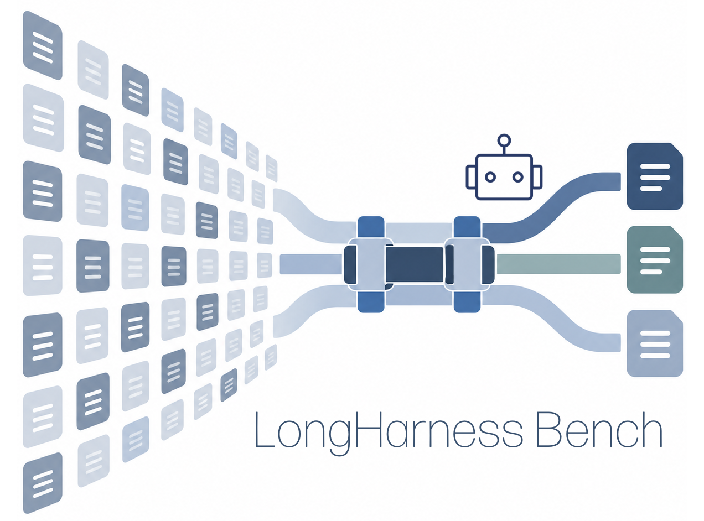

<p align="center">
  
</p>

# LongHarness Bench: Stress-Testing Language Model Harnesses for Long-Context Reasoning

LongHarness evaluates how language-model harnesses access and reason over long
contexts. Its four task suites contain 200 instances that require selective
retrieval, verification, and multi-step reasoning.

## Links

- [Project website](https://stringnlplab.github.io/longharness)
- [Paper](https://arxiv.org/abs/2609.38137)
- [Full dataset](https://huggingface.co/datasets/StringNLP/longharness)
- [GitHub repository](https://github.com/StringNLPLAB/longharness)

## Benchmark

| Task | Objective | Instances |
|---|---|---:|
| Constraint Solving Search | Find the five people satisfying all query conditions across documents about 160 people. | 50 |
| Equivalent Program Pair Search | Recover all semantically equivalent pairs among 200 anonymous Python programs. | 50 |
| Program Execution Tracing | Trace an eight-step query through semantically equivalent earlier computations. | 50 |
| Outlier Memo Detection | Find 15 conflicting memos among 700 memos containing 2,500 statements. | 50 |

The GitHub repository includes two complete examples per task. Hugging Face
hosts all 200 contexts, manifests, and answer keys.

## Get Started

Clone the examples, scorer, and website source:

```bash
git clone https://github.com/StringNLPLAB/longharness.git
cd longharness
```

Download the complete benchmark:

```bash
hf download StringNLP/longharness \
  --repo-type dataset \
  --local-dir longharness-data
```

Contexts are model-visible. Answer files must remain outside the agent's
workspace during evaluation.

Verify the eight GitHub examples:

```bash
python tools/verify_release.py --examples
```

Verify the complete 200-instance download with:

```bash
(cd longharness-data && python tools/verify_release.py)
```

## Evaluate

`score.py` accepts one JSON object per line with `task`, `index`, and
`prediction`. Predictions use these schemas:

- Constraint Solving Search: `{"matches": [...]}`
- Equivalent Program Pair Search: `[[cell_a, cell_b], ...]`
- Program Execution Tracing: `{"answer": {...}, "evidence": [...]}`
- Outlier Memo Detection: `["M-001", "M-002", ...]`

Score a full release from the downloaded dataset directory:

```bash
(cd longharness-data && \
  python score.py ../predictions.jsonl --output scores.json)
```

Score only the GitHub examples with:

```bash
python score.py predictions.jsonl \
  --manifest examples-manifest.jsonl \
  --output scores.json
```

The primary metric is exact instance accuracy. The scorer also reports
answer-only accuracy for tasks whose required response includes provenance.

## Citation

Please cite the LongHarness Bench paper:

```bibtex
@misc{pham2026longharness,
  title  = {{LongHarness Bench}: Stress-Testing Language Model Harnesses for Long-Context Reasoning},
  author = {Pham, Quang Hieu and Nguyen, Thuy Duong and Chen, Jocelyn Qiaochu and Ye, Xi},
  year   = {2026},
  eprint = {2609.38137},
  archivePrefix = {arXiv},
  primaryClass = {cs.CL},
  url    = {https://arxiv.org/abs/2609.38137}
}
```
